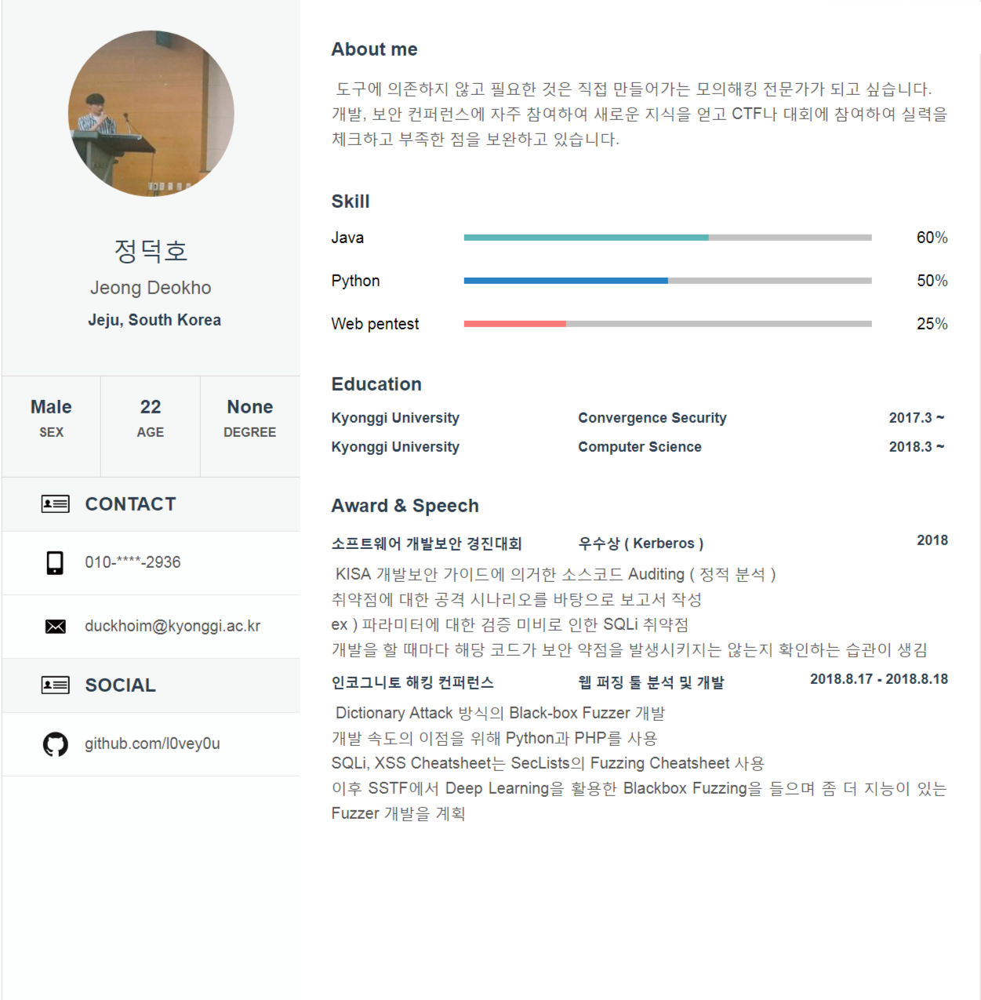

## 인생 정리
> 직무 경험
- [경기대학교 침해사고 대응팀 < 2017.12 ~ 2018.12 >](/src/experience/KyonggiUnivCert.md)
- [교육사 상무대 CERT < 2019.07 ~ >]()
> 대회 수상
- [2017 제 1회 경기대학교 해킹방어대회 KCTF < 동상 >](src/awards/KCTF.md)
- [2018 소프트웨어 개발 보안 경진대회 < 우수상 >](src/awards/%EC%86%8C%ED%94%84%ED%8A%B8%EC%9B%A8%EC%96%B4_%EA%B0%9C%EB%B0%9C%EB%B3%B4%EC%95%88_%EA%B2%BD%EC%A7%84%EB%8C%80%ED%9A%8C.md)
> 컨퍼런스 발표
- [2018 인코그니토 해킹 컨퍼런스 발표 < 웹 퍼징 >](src/conf/IncognitoHackingConference.md)
> 컨퍼런스 참가
- [2018 제 2회 Samsung Security Tech Forum 참가]()
- [2018 if(kakao)dev 2018 참가]()
- [2019 제 9회 SW개발보안 컨퍼런스 참가]()

> 기술 스택
- ```Java``` : [뮤직플레이어](src/techStack/JAVA/MusicPlayer.md)
- ```Python``` : [Fuzzer](src/techStack/Python/Fuzzer.md)
## 이력서

> Made by Vue-Resume
